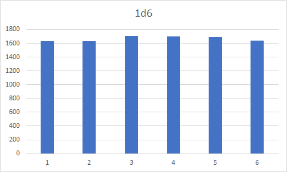

# #4: Dice
## Реализация
### Код
Код: [src/dice.hpp](../src/dice.hpp) и [src/dice.cpp](../src/dice.cpp)
### Константы
```c++
#define TEST_TRIES 10000
```
## Распределения
<br>
<br>
<br>
<br>
<br>
<br>
## Вывод программы
```text
Distribution of 1d6:
1;1629
2;1627
3;1710
4;1704
5;1689
6;1641

Distribution of 2d6:
2;260
3;541
4;856
5;1122
6;1418
7;1683
8;1379
9;1157
10;826
11;516
12;242

Distribution of 3d6:
3;53
4;156
5;268
6;477
7;650
8;958
9;1192
10;1262
11;1222
12;1165
13;1004
14;673
15;463
16;267
17;146
18;44

Distribution of 1d10:
1;1018
2;957
3;973
4;1042
5;966
6;976
7;976
8;1020
9;1065
10;1007

Distribution of 2d10:
2;103
3;203
4;265
5;411
6;472
7;614
8;709
9;798
10;902
11;1004
12;883
13;778
14;755
15;594
16;509
17;410
18;300
19;199
20;91

Distribution of 3d10:
3;11
4;25
5;50
6;111
7;156
8;226
9;265
10;381
11;475
12;541
13;630
14;682
15;727
16;738
17;748
18;737
19;710
20;652
21;549
22;466
23;329
24;254
25;203
26;150
27;93
28;47
29;30
30;14
```